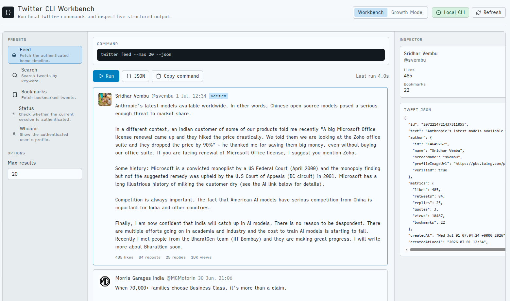

# Twitter CLI Workbench

Minimal Vue/Vite + FastAPI UI for the installed `twitter` CLI.



## Prerequisites

- `twitter` is installed and authenticated on this machine.
- Python 3.12 or compatible Python 3.
- Node.js 22 or compatible Node.js.

## Run Backend

```bash
python3 -m pip install -r backend/requirements.txt
python3 -m uvicorn app.main:app --app-dir backend --reload
```

The API runs on `http://127.0.0.1:8000`.

Optional backend environment variables:

- `DEEPSEEK_API_KEY`: required for Growth Mode analysis.
- `DEEPSEEK_MODEL`: defaults to `deepseek-v4-flash`.
- `GROWTH_DB_PATH`: defaults to `backend/growth.sqlite3`.

Put these in `.env` at the project root or `backend/.env`. Shell environment variables still win over `.env` values.

## Run Frontend

```bash
npm --prefix frontend install
npm --prefix frontend run dev
```

Open the Vite URL, usually `http://localhost:5173`.

## Run Both Services

```bash
./start.sh
./stop.sh
```

Defaults:

- Backend: `http://127.0.0.1:8010`
- Frontend: `http://localhost:5173`
- Logs and PID files: `.run/`

You can override ports:

```bash
BACKEND_PORT=8011 FRONTEND_PORT=5174 ./start.sh
```

## Verify

```bash
python3 -m pytest backend/tests -q
npm --prefix frontend test
npm --prefix frontend run build
```

The first screen fetches real data with `twitter feed --max 20 --json` through the FastAPI backend.

## Growth Mode

Growth Mode discovers candidate posts with `twitter search`, sends the candidate list to DeepSeek for `like`, `comment`, or `skip` recommendations, and shows each recommendation for manual approval.

No write action runs automatically. The UI shows the exact command and requires one approval per action before the backend executes `twitter like <tweet_id> --json` or `twitter reply <tweet_id> <text> --json`.

## Preference Memory

The app records approval and rejection context in the local Growth Mode SQLite database. For each decision it stores the source post, recommendation reason, available comment drafts, selected or edited comment, action, and outcome.

Before DeepSeek analyzes new candidates, the backend summarizes recent approved comments, rejected recommendations, and approved skips, then includes that memory in the DeepSeek request. This lets recommendations adapt toward the comments you approve and away from posts or drafts you skip or reject.
